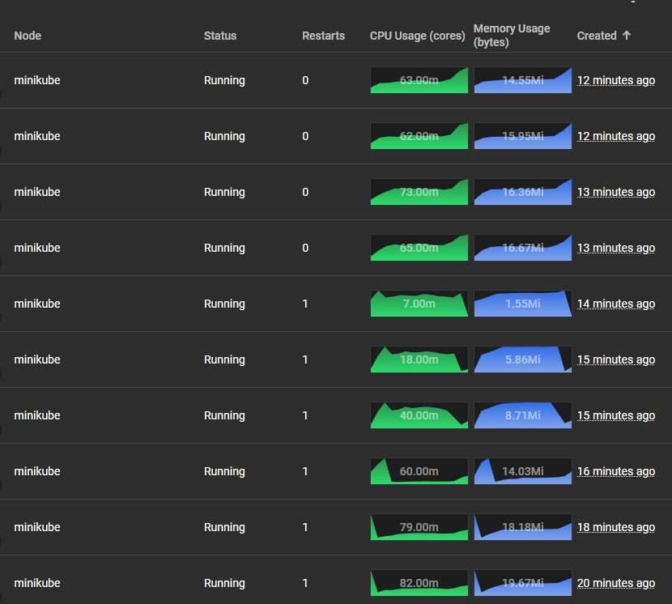

# Задание 1
Схема: [InureTech_технологическая архитектура_to-be.xml](./Exc1/InureTech_технологическая%20архитектура_to-be.xml)
## Масштабирование
Использование REST API подразумевает использование stateless компонентов, которые хорошо поддаются горизонтальному масштабированию. Следовательно HPA является оптимальным в данном случае. 
## Отказоустойчивость 
Поскольку недоступность приложения InsureTech имеет периодический характер, ключевым решением данной проблемы является создание специфическим метрик для идентификации проблемы.

Что касается СУБД шаблон PostgeSQL Patroni, представленный в рамках теории к данному модулю, является приемлемым для целей компании по созданию отказоустойчивого решения.

Active-active стратегия позволит лучше распределять нагрузку среди активных пользователей.
## Балансировка нагрузки
Балансировщик нагрузки уже реализован в рамках решения, однако, для улучшения опыта использования продукции компании среди региональных клиентов необходимо наличие геораспределенных ЦОД с GSBL.

# Задание 2
Конфигурируем:

`kubectl apply -f Deployment.yml,Service.yml,HPA.yml`

Получаем доступ к сервису:

`minikube service scaletestapp-service --url`

Запускаем locust:

`locust -H {ULR полученный в рамках предыдущего действия} --users=4000 --hatch-rate=10`

# Задание 3
Список проблем и рисков: [listOfIssues.txt](./Exc3/listOfIssues.txt)

Диаграмма контейнеров: [InsureTech_C4_сontainer-diagram.drawio.xml](./Exc3/InsureTech_C4_сontainer-diagram.drawio.xml)

Transactional outbox логично применять в каждом сервисе служащим источником события, т.е. каждый сервис подходит под данное условие.

# Задание 4

Обновленная диаграмма контейнеров: [InsureTech_C4_сontainer-diagram.drawio.xml](./Exc4/InsureTech_C4_сontainer-diagram.drawio.xml)

Core-app предоставляет REST API с функциями создания заявок и получения предложений по ОСАГО с Rate Limiting равным 20 запросов в минуту в рамках функции. Это ограничение необходимо, в первую очередь, для b2b клиентов работающих с API напрямую.

При этом, необходимо реализовать webhook'и для функции получения предложений по ОСАГО. Это уже необходимо, в первую очередь, для фронта и во вторую для b2b клиентов, поскольку не всем пойдодет данный формат взаимодействия. 

Данное решение подпадает под формулировку: "Бизнесу важно, чтобы на экране пользователя предложения от каждой страховой компании отображались сразу, как только от неё пришёл ответ."

Однако, ответ от страховой компании приходит не сам - страховые предоставляют 2 функции для создания и получения. Соответственно интеграционный контур опрашивает страховые компании в пределах 1-ой минуты ("Максимальное время ожидания решения от страховой компании — 60 секунд" - согласно условию задачи). Здесь уже страховые компании будут заинтересованы в реализации webhook'ов, это уже снимит нагрузку на их стороне, в свою очередь, это улучшит пользовательский опыт.

На уровне вебхуков необходимо реализовать логику повтора отправки информации в случае ошибок с их доставкой в рамках ограниченного количества итераций, при превышении которого формировать алерт-сообщение сотрудникам потребителя (это не должно быть проблемой, поскольку core-app должен знать с кем именно он осуществляет коммуникацию).

Поскольку коммуникация имеет место с внешними провайдерами (СК) - компания не обладает контролем и не несёт ответственность за качество предоставляемых ими услуг, следовательно, паттер circuit breaker должен иметь место на интеграционном уровне. В свою очередь, заявки на формирование информации должна обладать уникальным идентификатором для сведения на нет возможности генерирования избыточных запросов со стороны клиентов.  

# Задание 5

Схема: [schema.gql](./Exc5/schema.gql)

# Задание 6

Конфигурационный файл: [schema.gql](./Exc6/nginx.conf)
